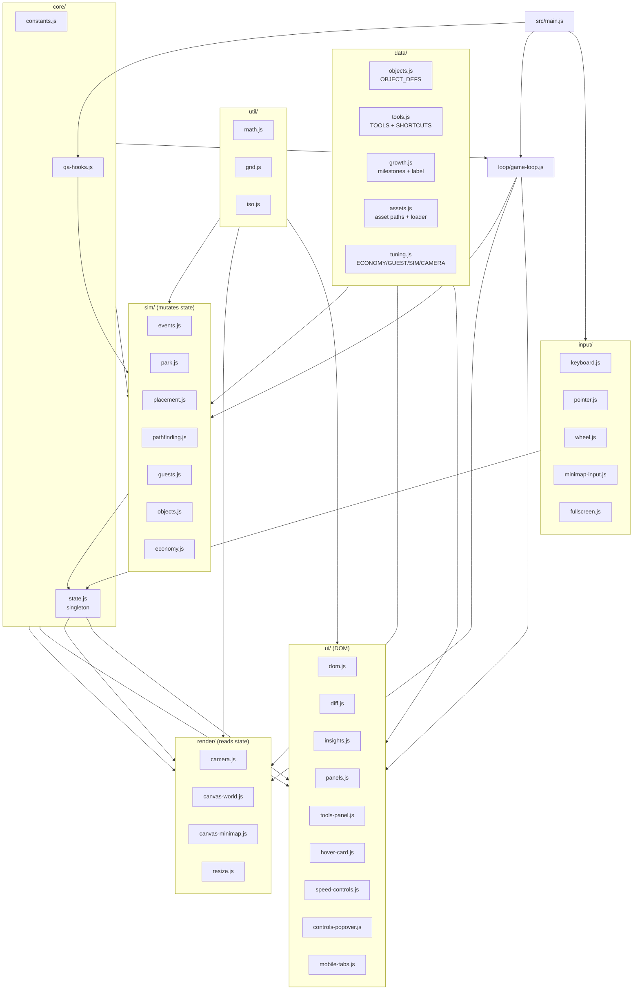

# Architecture

Wonderloop Park is split into strict layers. Each layer only imports from layers below it, which makes the dependency graph a DAG and prevents the kind of accidental coupling that grows in monolithic files.

```
data  →  util  →  core  →  sim  →  render + ui + input  →  loop  →  main
```

## Module map



## Tick lifecycle

```mermaid
sequenceDiagram
  participant RAF as requestAnimationFrame
  participant Loop as loop/game-loop
  participant Sim as sim/*
  participant UI as ui/panels
  participant World as canvas-world
  participant Mini as canvas-minimap

  RAF->>Loop: timestamp
  Loop->>Loop: updateCamera(realDt)
  Loop->>Sim: updateEconomy(simDt)
  Loop->>Sim: updateGuests(simDt)
  Loop->>Sim: updateObjects(simDt)
  Loop->>Sim: computeParkMetrics()
  Loop->>Sim: maybeAwardMilestones()
  Loop->>UI: renderPanels() if dirty or 0.2s elapsed
  Loop->>World: render()
  Loop->>Mini: renderMinimap()
```

`realDt` clocks the camera & UI throttle; `simDt = realDt * timeScale` drives the simulation. Setting `timeScale = 0` freezes the world while the camera and UI still respond.

## Layer rules

| Layer | Allowed to import from | Forbidden | Responsibilities |
|---|---|---|---|
| **data** | (nothing) | anything else | Pure constants, asset paths, tuning numbers, asset loader |
| **util** | core/constants | sim, render, ui, input, loop | Pure functions: math, grid math, isometric projection |
| **core** | data, util | sim, render, ui, input, loop | State singleton, QA hooks |
| **sim** | data, util, core | render, ui, input, loop | All gameplay logic — mutates state |
| **render** | data, util, core, sim* | ui, input, loop | Canvas drawing — reads state |
| **ui** | data, util, core, sim* | render, input, loop | DOM panels, diff renderer, hover card |
| **input** | data, util, core, sim, render, ui | loop | Translates pointer/keyboard/wheel into state mutations |
| **loop** | everything below | (only main imports loop) | Per-frame orchestration |
| **main** | everything | — | Wires the app, installs QA hooks |

*`sim` import from render/ui is one-directional: render and ui *read* sim helpers like `isObjectOperational`, but never call sim mutations.

## State

A single, plain JS object exported from [`src/core/state.js`](../src/core/state.js). It is constructed once at bootstrap and passed explicitly into nearly every function. The pattern keeps modules pure-ish without paying the cost of a reactive store.

`markUiDirty()` is the single signal that triggers an out-of-cadence panel render — used by mutating sim code to skip the 0.2 s debounce when something visibly changed (placement, removal, milestone, event).

## Why this layering?

- Tight loop fits in one file (`loop/game-loop.js`) — easy to reason about ordering bugs.
- Render & UI can never accidentally mutate state because they don't import any sim mutation helpers (only readers like `isObjectOperational`, `canPlaceTool`).
- Tuning lives in one place: every magic number (hunger rate, refund ratio, zoom bounds...) is in [`src/data/tuning.js`](../src/data/tuning.js).
- Tests can construct an isolated state via `createState()` without touching DOM or canvas.

## Quick navigation

| If you want to... | Edit |
|---|---|
| Change a ride's price, ticket, or excitement | `src/data/objects.js` |
| Add or rename a tool / shortcut | `src/data/tools.js` |
| Tune hunger, patience, spawn rates | `src/data/tuning.js` |
| Change milestone thresholds / rewards | `src/data/growth.js` |
| Tweak path/placement rules | `src/sim/placement.js` |
| Tweak guest AI weighting | `src/sim/guests.js` `chooseGuestDestination` |
| Add a new HUD panel | `src/ui/panels.js` + new section in `index.html` |
| Change the glass look | `styles/tokens.css` + `styles/components/glass.css` |
| Add a keyboard shortcut | `src/data/tools.js` (numeric) or `src/input/keyboard.js` (non-tool) |
